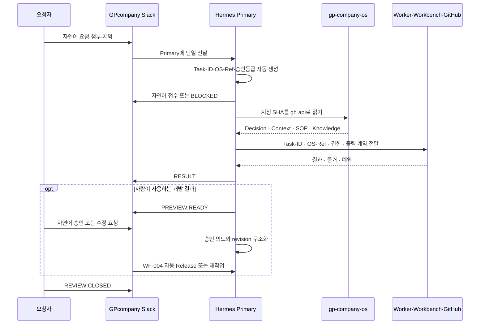

# WF-003 Slack to Hermes

- 상태: ACTIVE
- 버전: 1.0
- 소유자: GP Company CEO
- 변경일: 2026-07-22

## 목적

Slack 요청부터 OS 기준 확인, 실행, 검토 종료까지 하나의 `Task-ID`와 스레드로 추적한다.

## 흐름

## 상태 모델

| 상태 | Slack 표식 | 다음 상태 |
|---|---|---|
| `REQUESTED` | `[WORK_REQUEST]` | `ACKNOWLEDGED`, `BLOCKED` |
| `ACKNOWLEDGED` | `[ACK]` | `RUNNING`, `BLOCKED` |
| `RUNNING` | `[STATUS]` | `RESULT_REPORTED`, `BLOCKED` |
| `RESULT_REPORTED` | `[RESULT]` | `PREVIEW_READY`, `UNDER_REVIEW`, `CLOSED` |
| `PREVIEW_READY` | `[PREVIEW:READY]` | `UNDER_REVIEW`, `HUMAN_APPROVED` |
| `HUMAN_APPROVED` | `[HUMAN:APPROVED]` | WF-004 `RELEASE_VALIDATING` |
| `UNDER_REVIEW` | `[REVIEW]` | `RUNNING`, `RESULT_REPORTED`, `CLOSED` |
| `BLOCKED` | `[BLOCKED]` | `RUNNING`, `CLOSED` |
| `CLOSED` | `[REVIEW:CLOSED]` | 종료 |

## 불변 조건

- 하나의 `Task-ID`는 하나의 제어 스레드만 가진다.
- 하나의 작업에는 하나의 Hermes Primary만 응답한다.
- ACK 이후 RESULT까지 `OS-Ref`를 변경하지 않는다.
- Worker가 바뀌어도 `Task-ID`, `OS-Ref`, 승인등급과 안전 제약은 유지한다.
- Slack, Workbench, GitHub의 상태가 다르면 실행을 계속하기 전에 불일치를 기록·해소한다.
- `CLOSED` 작업은 새 `Task-ID` 또는 명시적 재개 승인 없이 다시 실행하지 않는다.
- 사람에게 Task-ID, OS-Ref, 상태 태그 또는 SHA 입력을 요구하지 않는다.
- `DEC-0007`의 Workbench Fast Lane은 `WF-005`를 사용하고 이 흐름에 중복 등록하지 않는다.

## 예외 흐름

- `OS-Ref` 오류: `BLOCKED` → 수정된 요청 검증 → `RUNNING`
- 추가 검증: `RESULT_REPORTED` → `UNDER_REVIEW` → `RUNNING` → 새 `RESULT`
- Primary 장애: 현재 실행과 부작용 확인 → 승인된 전환 → Standby가 같은 상태·증거를 인계
- Slack 장애: Workbench·GitHub에 상태 보존 → 연결 복구 → 원래 스레드에 동기화

## 관련 문서

- `../../LEVEL-3_OPERATING-KNOWLEDGE/DECISIONS/DEC-0005_HERMES-SLACK-ORCHESTRATION.md`
- `../../LEVEL-3_OPERATING-KNOWLEDGE/SOP/SOP-007_HERMES-SLACK-ORCHESTRATION.md`
- `../AGENTS/AGENT-HERMES.md`
- `../../TEMPLATES/HERMES-WORK-REQUEST.md`
- `WF-004_PREVIEW-TO-RELEASE.md`
- `WF-005_WORKBENCH-DIRECT-DEVELOPMENT.md`
