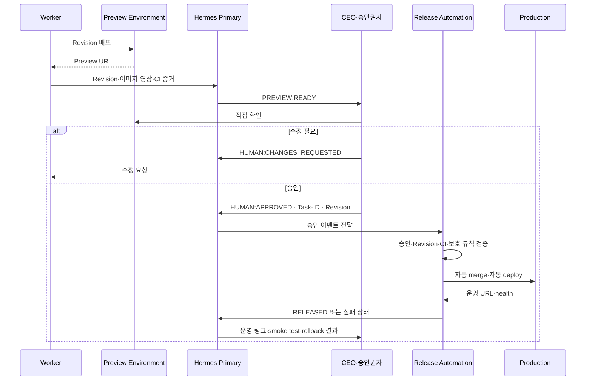

# WF-004 Preview to Automatic Release

- 상태: ACTIVE
- 버전: 1.0
- 소유자: GP Company CEO
- 변경일: 2026-07-22

## 목적

구현 결과를 사람이 직접 경험하고 승인한 뒤, 승인 revision만 자동 merge·배포한다.

이 Workflow는 표준 Human Preview 경로에 적용한다. `DEC-0007`의 GP Workbench Closed
Beta Fast Lane은 `WF-005`를 사용한다.

## 흐름

## 상태 모델

| 상태 | Slack 표식 | 다음 상태 |
|---|---|---|
| `IMPLEMENTED` | `[IMPLEMENTED]` | `PREVIEW_READY`, `BLOCKED_PREVIEW` |
| `PREVIEW_READY` | `[PREVIEW:READY]` | `CHANGES_REQUESTED`, `HUMAN_APPROVED` |
| `CHANGES_REQUESTED` | `[HUMAN:CHANGES_REQUESTED]` | `IMPLEMENTED` |
| `HUMAN_APPROVED` | `[HUMAN:APPROVED]` | `RELEASE_VALIDATING` |
| `RELEASE_VALIDATING` | `[RELEASE:VALIDATING]` | `MERGING`, `RELEASE_BLOCKED` |
| `MERGING` | `[MERGING]` | `DEPLOYING`, `RELEASE_BLOCKED` |
| `DEPLOYING` | `[DEPLOYING]` | `RELEASED`, `DEPLOY_FAILED`, `ROLLED_BACK` |
| `RELEASED` | `[RELEASED]` | `CLOSED` |
| `RELEASE_BLOCKED` | `[RELEASE:BLOCKED]` | `IMPLEMENTED`, `PREVIEW_READY` |
| `DEPLOY_FAILED` | `[DEPLOY:FAILED]` | `ROLLED_BACK`, `BLOCKED` |
| `ROLLED_BACK` | `[ROLLED_BACK]` | `IMPLEMENTED`, `CLOSED` |

## 불변 조건

- Preview, 승인, merge 대상은 동일한 40자리 revision SHA를 가리킨다.
- 승인 후 commit이 추가되면 merge하지 않는다.
- Preview를 사람이 직접 열 수 없으면 승인 요청을 보내지 않는다.
- 유효한 승인 전에는 target branch merge와 운영 배포를 시작하지 않는다.
- 유효한 승인 후에는 별도 수동 merge 승인 없이 자동 Release를 시작한다.
- 배포 성공만으로 종료하지 않고 운영 환경 smoke test를 통과해야 한다.
- 모든 단계는 같은 `Task-ID`와 Slack 스레드에 연결한다.

## 관련 문서

- `../../LEVEL-3_OPERATING-KNOWLEDGE/DECISIONS/DEC-0006_HUMAN-PREVIEW-AUTOMATIC-RELEASE.md`
- `../../LEVEL-3_OPERATING-KNOWLEDGE/SOP/SOP-008_HUMAN-PREVIEW-AUTOMATIC-RELEASE.md`
- `../AUTOMATION/AUT-006_PREVIEW-APPROVAL-RELEASE.md`
- `WF-005_WORKBENCH-DIRECT-DEVELOPMENT.md`
