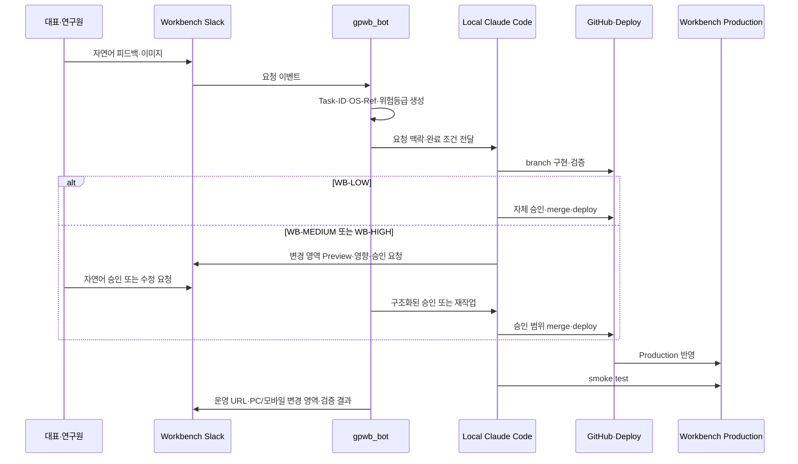

# WF-005 Workbench Direct Development

- 상태: ACTIVE
- 버전: 1.0
- 소유자: GP Company CEO
- 변경일: 2026-07-22

## 목적

Workbench Closed Beta 피드백을 Hermes의 일반 업무 큐와 분리해 로컬 Claude Code가 빠르게
구현하고, 위험에 따라 자체 Release 또는 사람 승인을 수행한다.

## Trigger and Completion

- Trigger: Workbench Slack에 Closed Beta 피드백이 접수됨
- 완료: 운영 반영·시각 증거·smoke test가 보고되거나 안전 차단·rollback 상태가 기록됨

## 흐름

## 불변 조건

- Hermes는 이 흐름의 필수 중계자나 Release gate가 아니다.
- 사람에게 기계 태그, Task-ID, OS-Ref 또는 SHA 입력을 요구하지 않는다.
- 로컬 Claude Code 인증이 없으면 별도 과금 API로 자동 전환하지 않는다.
- `WB-LOW`만 자체 승인한다. 중위험·고위험을 편의상 낮춰 분류하지 않는다.
- 실패한 배포는 성공으로 보고하지 않으며 rollback 또는 안전 차단 상태를 함께 알린다.

## Knowledge Feedback

반복 피드백은 제품 Insight 또는 SOP 후보로 분류하고, 실패한 변경은 재현 조건과 함께
FAILURE 후보로 전달한다. 실제 고객·처방·원가 데이터는 저장하지 않는다.

## KPI

- 피드백→운영 반영 리드타임
- 위험등급별 Human Gate 적용률
- 배포 실패·rollback·재작업률
- PC·모바일 시각 증거와 smoke test 완성률

## 관련 문서

- `../../LEVEL-3_OPERATING-KNOWLEDGE/DECISIONS/DEC-0007_WORKBENCH-CLOSED-BETA-FAST-LANE.md`
- `../../LEVEL-3_OPERATING-KNOWLEDGE/SOP/SOP-009_WORKBENCH-CLOSED-BETA-FAST-LANE.md`
