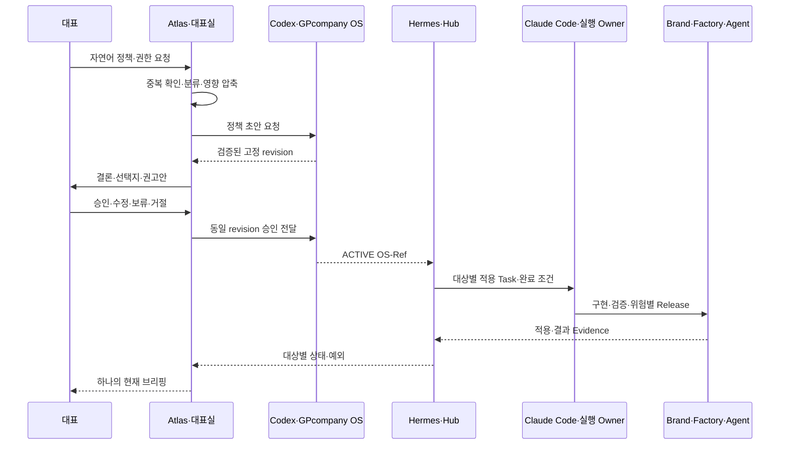

# WF-009 GPcompany OS 정책 전달과 적용 확인

- 상태: ACTIVE
- 소유자: GP Company CEO / CEO Co-Operator
- 적용 사업: 전사
- 버전: 1.0
- 작성일: 2026-08-12
- 검토일: 첫 대표실 Pilot 종료 후
- 적용 Decision: DEC-0017
- Learning-Ref: DEC-0011

## Purpose

대표의 자연어 정책 입력을 GPcompany OS의 승인된 정본으로 만들고, 그 변경을 Hub,
Workbench, Brand, Factory, Agent와 Automation에 전달한 뒤 실제 운영 결과까지 확인한다.

정책 승인과 구현 완료를 같은 상태로 보지 않으며, 각 시스템이 서로의 원본을 침범하지
않고 하나의 Task-ID와 OS-Ref로 연결되게 한다.

## Trigger and Completion

### Trigger

- 대표의 요청이 정책·권한·승인 Gate·예외 변경 후보로 분류됨
- ACTIVE Decision·Context·SOP의 충돌이나 만료가 발견됨
- Runtime 권한의 긴급 회수가 필요함
- 실행 결과가 회사 공통 기준 변경 후보로 검증됨

### Completion

- 대표가 승인한 동일 revision이 GPcompany OS main에서 ACTIVE가 됨
- 영향 대상이 `NOT_REQUIRED` 또는 `VERIFIED`로 판정됨
- 정책·권한·실행 부작용과 미확인 사항이 해소됨
- 결과가 미래에 발생하면 Owner·측정일·원천을 가진 `RESULT_PENDING`이 연결됨
- 대표실이 최종 결론과 남은 재검토 조건을 보고함

## Roles and Systems

| 구간 | 책임 | 시스템 | 입력 | 출력 |
|---|---|---|---|---|
| 자연어 접수 | 대표 / Atlas | Workbench 대표실, 전환기 Slack | 요청·목표·제약 | 단일 Task·접수 보고 |
| 분류·영향 | Atlas / CEO Co-Operator | Workbench·OS | 현재 OS-Ref·회사 상태 | 문서 유형·영향·결정안 |
| 정책 작성 | Codex | gp-company-os | 승인 대기 결정안 | 검증된 OS revision |
| 정책 승인 | 대표 | 대표실·정확한 Preview | 결정안·revision | 승인·수정·보류·거절 |
| 정본 반영 | Codex / 승인된 Release 절차 | gp-company-os main | 동일 승인 revision | ACTIVE OS-Ref |
| 전달 | Hermes Primary / Hub | gp-company-hub | 새 OS-Ref·영향 대상 | 대상별 적용 Task |
| 구현 | Claude Code / 실행 Owner | gpcompany-lab·프로젝트 저장소 | 적용 Task·OS-Ref | 변경·테스트·Preview |
| 운영 적용 | 실행 Owner / Release | Workbench·운영 시스템 | 승인된 구현 revision | 적용 Evidence |
| 결과 확인 | Atlas / Reviewer | Workbench·원본 Evidence | 적용 결과·KPI·예외 | VERIFIED·RESULT_PENDING |
| 대표 보고 | Atlas | 대표실 현재 브리핑 | 전체 상태·예외 | 결론·결정·다음 보고 |

Atlas는 대표 보고를 소유하지만 실행 큐를 소유하지 않는다. Hermes가 회사 Task의 단일
Primary이고, Orca는 Hermes가 고정한 범위 안에서 Worker를 조정한다.

## State Model

```text
REQUESTED
→ CLASSIFIED
→ IMPACT_REVIEW
→ DRAFT_READY
→ CEO_APPROVAL_PENDING
→ CEO_APPROVED
→ OS_ACTIVE
→ PROPAGATION_QUEUED
→ DELIVERED
→ IMPLEMENTED
→ APPLIED
→ VERIFIED 또는 RESULT_PENDING
→ CLOSED
```

`REVISION_REQUESTED`, `REJECTED`, `BLOCKED`, `CANCELLED`는 어느 승인 전 단계에서도
발생할 수 있다. `CEO_APPROVED`에서 revision이 바뀌면 `DRAFT_READY`로 돌아간다.

| 현재 상태 | 조건/입력 | 다음 상태 | 책임자 | 관련 SOP | 생성 기록 |
|---|---|---|---|---|---|
| `REQUESTED` | 자연어 요청 또는 변경 Trigger | `CLASSIFIED` | Atlas / Hermes | SOP-016 | Task-ID·현재 OS-Ref |
| `CLASSIFIED` | OS 변경 유형과 구현 분리 | `IMPACT_REVIEW` | Atlas / Codex | SOP-016 | 문서 유형·비적용 범위 |
| `IMPACT_REVIEW` | ACTIVE 기준·권한·대상 확인 | `DRAFT_READY` | Codex | SOP-016 | 충돌·영향·선택지 |
| `DRAFT_READY` | 검증된 고정 revision 준비 | `CEO_APPROVAL_PENDING` | Codex / Atlas | SOP-016 | 결정 패키지·revision |
| `CEO_APPROVAL_PENDING` | 승인 | `CEO_APPROVED` | 대표 | SOP-016 | 승인 의도·범위 |
| `CEO_APPROVAL_PENDING` | 수정·보류·거절 | `REVISION_REQUESTED`, `BLOCKED`, `REJECTED` | 대표 | SOP-016 | 사유·안전 기본 동작 |
| `CEO_APPROVED` | 동일 revision main 반영 | `OS_ACTIVE` | Codex / Release | SOP-016 | 40자리 OS-Ref |
| `OS_ACTIVE` | 영향 대상 판정 | `PROPAGATION_QUEUED` | Hermes / Hub | SOP-016 | 대상·Owner·완료 조건 |
| `PROPAGATION_QUEUED` | 대상별 Task·Draft PR 생성 | `DELIVERED` | Hermes / Claude Code | SOP-016 | 저장소 작업 참조 |
| `DELIVERED` | 구현·테스트·Preview 완료 | `IMPLEMENTED` | Claude Code / Owner | 저장소 SOP | revision·검증 |
| `IMPLEMENTED` | 위험등급별 승인·Release | `APPLIED` | 실행 Owner | 저장소 SOP | 운영 적용 Evidence |
| `APPLIED` | 실제 동작·결과 확인 가능 | `VERIFIED` | Reviewer / Atlas | SOP-016 | Outcome·부작용 |
| `APPLIED` | 결과가 미래에 발생 | `RESULT_PENDING` | Owner | SOP-013, 014 | 측정일·원천 |
| `RESULT_PENDING` | 측정 완료 | `VERIFIED` | Owner / Reviewer | SOP-013, 014 | Outcome·판정 |
| `VERIFIED` | 모든 대상 완료·미해결 없음 | `CLOSED` | Atlas / Hermes | SOP-016 | 최종 대표 보고 |

대상이 여러 개이면 각 대상은 `NOT_REQUIRED / DELIVERY_PENDING / DELIVERED /
IMPLEMENTED / APPLIED / VERIFIED`를 별도로 가진다. 전체 Workflow는 가장 느린 필수 대상을
기준으로 하며, 일부 완료를 전체 완료로 올리지 않는다.

## Policy Propagation



## Representative Briefing Contract

대표실은 대상별 기술 보고를 그대로 나열하지 않는다.

- 승인이 필요하면 같은 정책의 모든 영향과 선택지를 `지금 결정` 한 항목으로 묶는다.
- 적용 실패가 여러 저장소에서 발생해도 공통 원인과 회사 영향을 `오늘 알 것` 한 영역으로
  합친다.
- 승인 범위 안의 전달·구현·검증은 `안전하게 진행 중` 한 줄로 보고한다.
- 대표가 상세를 펼치면 대상별 상태, Evidence, 담당과 revision을 볼 수 있다.

## Approval and Exceptions

- 정책·권한의 `OS_ACTIVE` 전환은 대표가 확인한 동일 revision만 허용한다.
- 권한 부여는 OS_ACTIVE 전 Runtime 적용을 금지한다.
- 긴급 권한 회수는 피해 방지를 위해 Runtime을 먼저 정지할 수 있다. 정지 뒤 즉시
  `REQUESTED` Task를 만들고 OS 기록 완료 전 재개하지 않는다.
- 외부 공개·발송, 가격·예산·계약·법률·규정·생산과 비가역 변경은 기존 Gate를 유지한다.
- 단순 UI·기술 구현은 정책 변경이 아니면 이 Workflow를 거치지 않고 저장소별 Fast Lane을
  사용할 수 있다.
- 한 대상의 적용 실패는 독립된 안전 작업을 모두 중지시키지 않는다.

## Cancellation and Recovery

- 승인 전 취소: 초안 상태와 취소 사유를 남기고 하위 전달을 만들지 않는다.
- OS_ACTIVE 후 취소: 새 정책 변경 Task로 되돌림·대체 Decision을 만들고 이미 전달된
  대상의 적용 상태와 부작용을 확인한다.
- 잘못된 대상 전달: 해당 적용 Task를 중지하고 다른 대상 영향과 중복 실행을 점검한다.
- 적용 실패: 저장소별 rollback 또는 안전 차단을 수행하고 대표실에는 회사 영향과
  재개 조건만 압축 보고한다.
- Workbench·Hub·GitHub 상태 불일치: 가장 보수적인 상태로 낮추고 정확한 revision과
  운영 Evidence로 해소하기 전 다음 외부 실행을 확대하지 않는다.
- Ghost OS-Ref: main 조상이 아닌 commit을 권한 근거로 사용하지 않고 `BLOCKED_GHOST_REF`로
  격리한다.

## Knowledge Feedback

- 정책 변경 전 관련 ACTIVE Knowledge, 최근 실패와 반복 대표 지시를 확인한다.
- 적용 뒤 기대와 실제 결과, 대표 검색·재질문·승인 대기와 재작업 변화를 기록한다.
- 결과가 새로운 공통 기준이면 Decision·SOP·Knowledge 후보로 되돌린다.
- 다음 유사 정책 변경에서 분류·영향·전달 실패가 줄었는지 Reuse Verification을 수행한다.
- Evidence와 적용 대상 역참조가 없으면 학습 완료로 보지 않는다.

## KPI

- 자연어 요청부터 대표 결정안까지 걸린 시간
- 대표가 목록 검색으로 발견한 중요 결정 건수
- 같은 정책의 중복 Task와 중복 적용 건수
- 승인 revision과 ACTIVE revision 불일치 건수
- `OS_ACTIVE → DELIVERED → APPLIED → VERIFIED` 단계별 체류시간
- 정책은 ACTIVE지만 적용되지 않은 대상 수
- 권한 부여·회수 실패와 기존 Gate 위반
- 적용 후 재작업·rollback과 같은 문제 재발률

## Related Documents

- `../../LEVEL-3_OPERATING-KNOWLEDGE/DECISIONS/DEC-0017_CEO-OFFICE-AND-UNATTENDED-EXECUTION.md`
- `../../LEVEL-3_OPERATING-KNOWLEDGE/SOP/SOP-016_COMPANY-OS-POLICY-LIFECYCLE.md`
- `../../LEVEL-3_OPERATING-KNOWLEDGE/SOP/SOP-013_ORGANIZATIONAL-LEARNING-CYCLE.md`
- `../AGENTS/AGENT-CEO-COOPERATOR.md`
- `../AGENTS/AGENT-HERMES.md`
- `../../TEMPLATES/COMPANY-OS-CHANGE-ENVELOPE.md`
- `../../TEMPLATES/CEO-BRIEFING-TEMPLATE.md`
