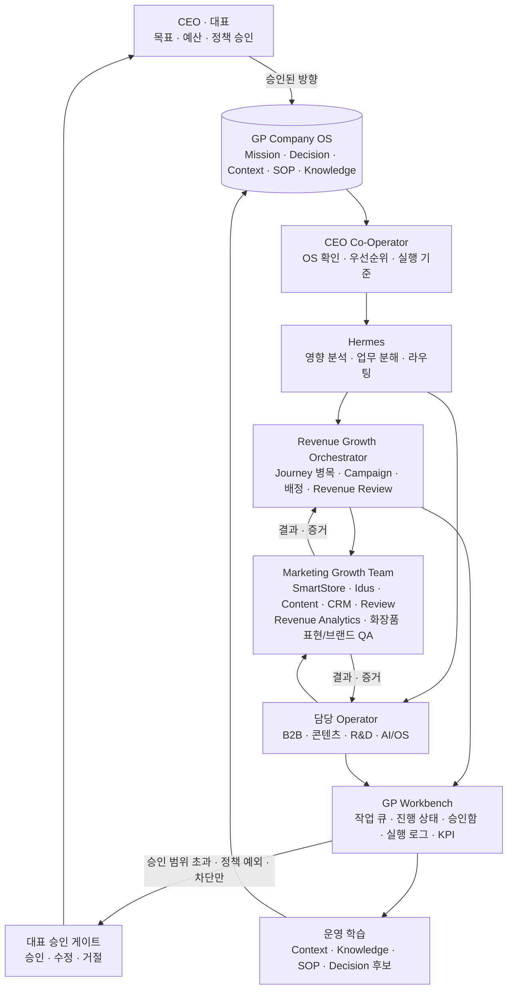
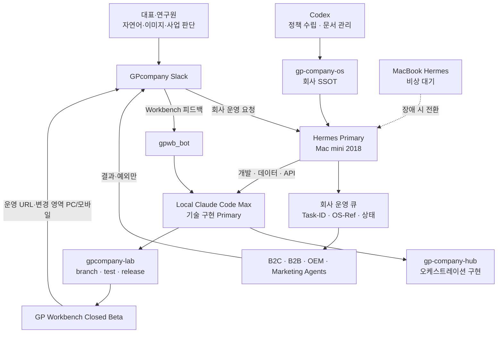

# GP Company OS

**Version:** 0.3.0
**Status:** ACTIVE
**Owner:** GP Company CEO  
**Purpose:** GP Company를 Hair·Scalp 사업과 AI·Company OS 사업이 함께 성장하고, 대표 개인이 아니라 양도 가능한 시스템으로 운영되는 AI Native Company로 전환한다.

> 새로운 AI와 사람의 첫 진입점은 [`SYSTEM_BOOT.md`](./SYSTEM_BOOT.md)다. 이 README는
> OS의 전체 지도이며, 실제 실행 전에는 관련 ACTIVE Decision·Context·SOP를 확인한다.

## Project Introduction

GP Company OS는 문서 보관함이 아니라 회사의 두 번째 두뇌다. Mission부터 사업,
의사결정, 업무 흐름, 표준 절차, Agent, 자동화와 경영 피드백까지 하나의 추적 가능한
운영체계로 연결한다. Claude Code, Codex, Cursor, GitHub Copilot과 사람이 같은 기준을
읽고 협업하는 것을 목표로 한다.

## Mission and Vision

- **Mission:** Hair와 Scalp의 좋은 아이디어가 규모의 한계 때문에 멈추지 않게 하고,
  실제 운영에서 검증한 AI Company OS로 기업의 실행력과 성장을 만든다.
- **Vision:** 제조·브랜드 운영에서 검증된 지식과 AI 실행체계를 연결하여, 대표 개인이
  아니라 새로운 경영자도 인수·운영 가능한 회사와 두 개의 수익 엔진을 만든다.

원문은 [`MISSION.md`](./LEVEL-1_DIRECTION/MISSION.md)와
[`VISION.md`](./LEVEL-1_DIRECTION/VISION.md)를 따른다.
모든 작업의 짧은 방향 확인은 [`DIRECTION-SNAPSHOT.md`](./LEVEL-1_DIRECTION/DIRECTION-SNAPSHOT.md)를
사용하고, 가격·프로모션·외부 쓰기·신규 사업·권한·정책 변경은 `DEC-0014`에 따라
Mission·Vision 원문까지 읽는다.

## Corporate Direction

GP Company는 두 개의 수익 엔진을 운영한다.

1. **Hair & Scalp Business:** B2B 제조와 B2C 브랜드·커머스를 통해 고객 가치와 현금흐름을 만든다.
2. **AI & Company OS Business:** 내부에서 검증한 OS, Agent, Workflow와 Workbench를 제품과 서비스로 발전시킨다.

`gp-company-os`는 회사의 최상위 전략·정책·Decision 원본이다. 다른 저장소와 실행 시스템은 활성 OS 문서를 기준으로 변경한다.

현재 실행 우선순위는 [`DEC-0009`](./LEVEL-3_OPERATING-KNOWLEDGE/DECISIONS/DEC-0009_REVENUE-FIRST.md)의
`Revenue First`다. 운영체계의 일관성은 유지하되, 신규 고객·판매·재구매·대표의 마케팅
병목과 반복 가능한 성장에 연결되지 않는 설계는 우선순위를 낮춘다.

## OS Philosophy and Operating Test

OS는 다음 원칙으로 성장한다.

`현장 증거 → 검증 → Context·Knowledge → Decision·SOP → Workflow·Agent·Automation → KPI·Review → 개선`

- 문서 수보다 출처, 상태, 책임과 연결의 품질을 우선한다.
- 관련 Knowledge를 실행 전에 소비하고, 적용·비적용 이유와 실제 Outcome을 남긴다.
- Knowledge 생성만으로 학습 완료로 보지 않고, 소비 파일 반영과 다음 실행의 재사용 효과를
  확인한다.
- 자동화보다 SOP, SOP보다 실제 업무 검증을 먼저 한다.
- AI는 자율적으로 회사 정책을 만드는 존재가 아니라 승인된 운영체계를 실행하고
  개선 후보를 제안하는 협업자다.
- 민감한 운영 원문은 보안 저장소에 두고, OS에는 기준과 안전한 참조만 둔다.

모든 업무는 다음 순서로 판단한다.

1. 신규 고객·판매·재구매 또는 반복 가능한 성장에 기여하는가?
2. 대표의 마케팅 병목을 줄이는가?
3. Mission과 일치하는가?
4. 기존 Decision과 충돌하지 않는가?
5. Context와 맞는가?
6. 기존 SOP가 존재하는가?
7. 자동화 가능한가?
8. 새로운 Knowledge가 되는가?

## AI Onboarding and Reading Order

새 AI는 다음 순서로 온보딩한다.

1. [`SYSTEM_BOOT.md`](./SYSTEM_BOOT.md)
2. `README.md`
3. [`MANIFEST.md`](./LEVEL-1_DIRECTION/MANIFEST.md)
4. [`BLUEPRINT.md`](./LEVEL-1_DIRECTION/BLUEPRINT.md)
5. 관련 [`CONTEXT`](./LEVEL-3_OPERATING-KNOWLEDGE/CONTEXT)
6. 관련 [`DECISIONS`](./LEVEL-3_OPERATING-KNOWLEDGE/DECISIONS)
7. [`AGENTS.md`](./AGENTS.md)와 관련 Agent 명세
8. 관련 [`WORKFLOW`](./LEVEL-4_AI-EXECUTION/WORKFLOW)
9. 관련 [`SOP`](./LEVEL-3_OPERATING-KNOWLEDGE/SOP)
10. 관련 [`AUTOMATION`](./LEVEL-4_AI-EXECUTION/AUTOMATION)

기계가 읽는 전체 색인과 유형 계약은 [`OS-INDEX.yaml`](./OS-INDEX.yaml)을 사용한다.
사람을 위한 짧은 운영 시작 안내는 [`START-HERE.md`](./START-HERE.md)다.

## Repository Map

| 경로 | 단일 책임 |
|---|---|
| `LEVEL-1_DIRECTION` | Mission, Vision, 철학과 전체 시스템 설계 |
| `LEVEL-2_BUSINESS` | 사업별 고객가치, 수익모델과 운영정책 |
| `LEVEL-3_OPERATING-KNOWLEDGE/CONTEXT` | 현재 상태, 제약, 우선순위와 유효기간 |
| `LEVEL-3_OPERATING-KNOWLEDGE/DECISIONS` | 승인된 선택, 이유, 영향과 재검토 조건 |
| `LEVEL-3_OPERATING-KNOWLEDGE/KNOWLEDGE` | 근거와 적용 범위가 검증된 재사용 지식 |
| `LEVEL-3_OPERATING-KNOWLEDGE/SOP` | 한 반복 업무의 표준 수행·승인·예외 처리 |
| `LEVEL-3_OPERATING-KNOWLEDGE/PROMPT-LIBRARY` | 승인된 SOP 실행을 위한 AI 입력 형식 |
| `LEVEL-4_AI-EXECUTION/WORKFLOW` | 역할·시스템을 가로지르는 상태 흐름 |
| `LEVEL-4_AI-EXECUTION/AGENTS` | 역할별 입력·출력·권한·책임 계약 |
| `LEVEL-4_AI-EXECUTION/AUTOMATION` | 검증된 Workflow·SOP 단계의 기계 실행 계약 |
| `LEVEL-5_MANAGEMENT-CONTROL` | KPI, Dashboard, Roadmap과 정기 경영 리뷰 |
| `TEMPLATES` | 문서 유형별 신규 작성 계약 |
| `.github` | 변경 제안, 검토와 소유권 통제 |

## 5-Level Architecture

| Level | 영역 | 목적 |
|---|---|---|
| LEVEL 1 | Direction | 회사의 존재 이유와 장기 방향 정의 |
| LEVEL 2 | Business | 사업영역별 운영 기준 정의 |
| LEVEL 3 | Operating Knowledge | SOP, 지식, 프롬프트, 결정, 맥락 축적 |
| LEVEL 4 | AI Execution | AI, Agent, Automation, Workflow, Memory 실행 |
| LEVEL 5 | Management Control | Dashboard, KPI, Roadmap, 정기 리뷰를 통한 경영 통제 |

## Company Operating Structure — 회사 운영 구조

GP Company의 목표 운영 구조는 대표가 모든 실행을 직접 지휘하는 방식이 아니다.
대표는 목표·예산·정책과 예외를 승인하고, CEO Co-Operator와 Hermes가 OS를 기준으로
Operator와 전문 실행 Agent를 조율한다. GP Workbench Closed Beta 개발은 별도의 Fast
Lane에서 `gpwb_bot`과 로컬 Claude Code가 직접 처리한다.

대표에게는 목표·정책·예산 변경, 외부 공개, 계약, 법률·규정, 고위험·비가역 실행과
기존 기준의 예외처럼 실제 판단이 필요한 항목만 올라간다. 승인된 정책 안의 가역적
업무는 담당 Operator가 검수하고 실행 기록을 남긴다.

## Repository and System Architecture — 저장소·시스템 구조

| 구성요소 | 역할 |
|---|---|
| [`gp-company-os`](https://github.com/ajseo-gp/gp-company-os) | 회사의 최상위 전략·정책·Decision 원본 |
| [`gp-company-hub`](https://github.com/ajseo-gp/gp-company-hub) | OS를 Hermes·Agent·프로젝트 운영 스펙으로 변환하는 오케스트레이션 레이어 |
| [`gpcompany-lab`](https://github.com/ajseo-gp/gpcompany-lab) 및 프로젝트 저장소 | Workbench 코드와 프로젝트별 실행 산출물 관리 |
| GP Workbench | 작업 큐·상태·승인함·실행 로그·KPI를 연결하는 실행 제어면 |
| Slack | 사람과 Hermes·Agent 사이의 요청·알림·승인 인터페이스 |
| GitHub | Decision·작업 정의·코드·검수 증거를 추적하는 지속 기록 |

세부 역할은 [`LEVEL-2_BUSINESS/B2C.md`](./LEVEL-2_BUSINESS/B2C.md),
[`LEVEL-2_BUSINESS/RND.md`](./LEVEL-2_BUSINESS/RND.md),
[`LEVEL-2_BUSINESS/PRODUCTION.md`](./LEVEL-2_BUSINESS/PRODUCTION.md),
[`LEVEL-4_AI-EXECUTION/AGENTS`](./LEVEL-4_AI-EXECUTION/AGENTS),
[`LEVEL-4_AI-EXECUTION/WORKFLOW`](./LEVEL-4_AI-EXECUTION/WORKFLOW)와
[`LEVEL-5_MANAGEMENT-CONTROL`](./LEVEL-5_MANAGEMENT-CONTROL)을 따른다. 장비 배치와
Hermes 운영 토폴로지는 `gp-company-hub`에서 관리한다.

AI 작업의 도구 경계는 [`DEC-0012`](./LEVEL-3_OPERATING-KNOWLEDGE/DECISIONS/DEC-0012_AI-WORK-ALLOCATION.md)를
따른다. Codex는 Company OS의 정책 수립·Decision·SOP·Knowledge·색인과 문서 정합성을
담당한다. Claude Code는 Hub·Workbench·프로젝트의 개발, 데이터 처리·분석, API·DB,
테스트, CI/CD와 배포를 담당한다. 혼합 요청은 정책을 먼저 고정한 뒤 Claude Code에
정확한 OS-Ref로 인계하며 같은 branch를 공동 소유하지 않는다.

Hermes 작업은 [`SOP-007`](./LEVEL-3_OPERATING-KNOWLEDGE/SOP/SOP-007_HERMES-SLACK-ORCHESTRATION.md)에
따라 자연어 요청을 Task-ID와 40자리 commit SHA의 `OS-Ref`가 포함된 내부 작업으로
변환한다. 사람은 이 값을 입력하지 않는다. Hermes는 로컬 clone이나 현재 브랜치가 아니라
지정 SHA의 Company OS 문서를 읽고 B2C·B2B·OEM·마케팅 업무를 라우팅한다.

사람이 사용하는 기능은 코드 검토만으로 merge하지 않는다. Agent가 동일 revision의
Preview URL과 시각 증거를 제공하고 대표가 Slack에서 승인하면, 해당 revision은 추가
수동 확인 없이 자동 merge·배포·smoke test로 진행한다. 세부 기준은
[`SOP-008`](./LEVEL-3_OPERATING-KNOWLEDGE/SOP/SOP-008_HUMAN-PREVIEW-AUTOMATIC-RELEASE.md)을
따른다. 단, GP Workbench Closed Beta는
[`DEC-0007`](./LEVEL-3_OPERATING-KNOWLEDGE/DECISIONS/DEC-0007_WORKBENCH-CLOSED-BETA-FAST-LANE.md)과
[`SOP-009`](./LEVEL-3_OPERATING-KNOWLEDGE/SOP/SOP-009_WORKBENCH-CLOSED-BETA-FAST-LANE.md)에
따라 `gpwb_bot`과 로컬 Claude Code가 직접 처리한다. 저위험 변경은 자체 승인·자동
배포 후 변경 영역 PC·모바일 이미지를 보고하고, 중위험·고위험 변경만 사전 Human
Preview를 요구한다.

## Primary Business Context

GP Company는 다음 영역을 동시에 운영한다.

- Hair·Scalp 중심 소량 OEM/ODM
- 자체 브랜드 젠틀파파 운영
- Hair·Scalp 제품 기획·제조·브랜드 운영
- 고객 문의→레시피 연구→견적→생산 LOT와 문서의 추적
- B2B 거래처 개발과 B2C 온라인 판매
- 콘텐츠 마케팅
- AI·Company OS 제품과 서비스 개발
- GP Workbench와 Agent 기반 업무 자동화
- GitHub 기반 회사 지식 관리

## Source of Truth Priority

1. `LEVEL-3_OPERATING-KNOWLEDGE/DECISIONS`
2. `LEVEL-3_OPERATING-KNOWLEDGE/CONTEXT`
3. `LEVEL-3_OPERATING-KNOWLEDGE/SOP`
4. `LEVEL-3_OPERATING-KNOWLEDGE/KNOWLEDGE`
5. `LEVEL-3_OPERATING-KNOWLEDGE/PROMPT-LIBRARY`
6. 일반적 AI 지식 또는 외부 정보

외부 정보가 기존 Decision과 충돌하면 대표 승인 전에는 기존 Decision을 유지한다.

## Document Status

각 문서는 다음 상태 중 하나를 사용한다.

- `DRAFT`: 초안, 검토 필요
- `ACTIVE`: 현재 운영 기준
- `REVIEW`: 수정 검토 중
- `ARCHIVED`: 더 이상 사용하지 않음

## Repository Rules

- 임의 추측을 사실처럼 기록하지 않는다.
- 대표가 확정한 사항은 Decision Record로 남긴다.
- 반복 업무는 SOP로 전환한다.
- AI 자동화는 반드시 해당 SOP와 연결한다.
- 다른 저장소와 실행 시스템은 적용한 OS 버전과 관련 Decision을 추적한다.
- 회사의 핵심 코드, 브랜드, 문서, 데이터와 계약의 소유권을 추적 가능하게 관리한다.
- 가격, 원가, 거래처 개인정보 등 민감정보는 공개 저장소에 기록하지 않는다.
